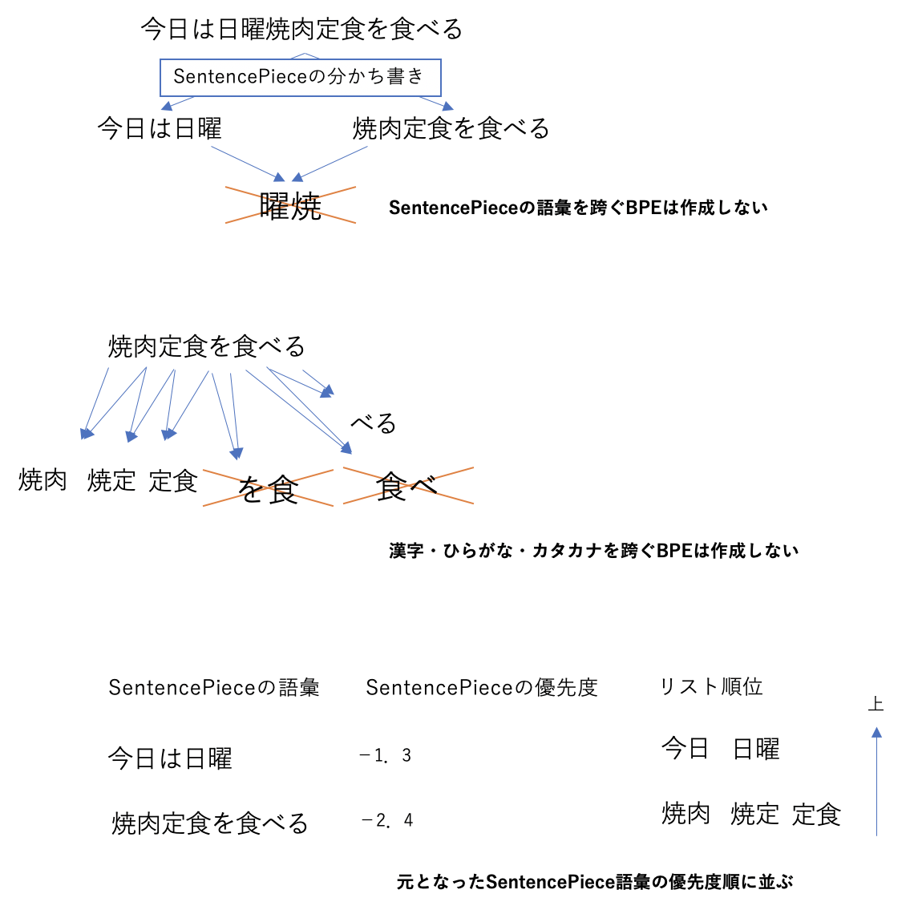

# Japanese-BPEEncoder


日本語文字列（UTF-8）のEncoder / Tokenizerです。UTF-8を文字ペア単位で分かち書きし、製数列にエンコードします。


## 日本語版BPEEncoder


機能的には、分かち書きを行うTokenizerに近いものですが、BERTやGPT-2等の機械学習モデルにおける用語に合わせて、Encoderとしています。

実際は、TokenizerとEncoerを組み合わせたもので、日本語文字列の分かち書きと整数列へのマッピングを同時に行います。


**分かち書き**＋**エンコード**

```
今日は日曜焼肉定食を食べる　→　[205, 17450, 3201, 17661, 15707, 16960, 6301, 7961, 1132]
```


### なぜ形態素解析では駄目なのか


従来の自然言語処理では、係り受け解析による形態素毎に文章を分割していました。


**形態素解析**

```
すもももももももものうち　→　すもも|も|もも|も|もも|の|うち
```


これが絶対に駄目という訳では無いのですが、係り受け解析は、基本的に、助詞や名詞のデータベースに基づく、人が作成したルールベースの処理によって、文章を解析します。

BERTやGPT-2等の現代的な機械学習モデルで使用しているSelf-Attentionが強力なのは、そうした人が作成したルールに依存せずに、広域的な単語（Encode後の単位での‘単語’）間の関連性を学習出来るためです。

**要するに、その係り受けを学習したい**のに、肝心の単語の分割が、人が作成したルールベースの処理であっては、人の性能を超えることが出来ない、というのが、形態素解析ではなくもっと細かい単位での学習を行うモチベーションとなります。

また、係り受け解析では、必要となる語彙数が予め解らない点も、機械学習モデルのトレーニングには不向きな理由です。トレーニングデータとテストデータで語彙数の差がある場合など、どうしても&lt;unk&gt;が登場します。


### BPEEncoderとは


そのようなわけで、単語をさらに細かく分割し、かつ&lt;unk&gt;が登場しないですむような小さい単位での学習を行うわけですが、小さい単位と言っても、どの程度まで細かくすれば良いか、によって、Encodeの仕方が変わります。

英語文字圏では、アルファベットは26種類しかありませんから、アルファベット単位での学習での学習を行うと、出力チャンネル数が少なくなりすぎます。

そこで現在の機械学習モデルでは、バイト単位での学習とワード単位での学習の中間となる、サブワード単位での学習を行うことが一般的です（[こちら](https://ai-scholar.tech/articles/others/roberta-ai-230)の記事などが詳しいです）。

オリジナルのBERTやGPT-2等では、 **Byte-Pair Encoding (BPE)**が使われます。


**Byte-Pair Encoding (BPE)**

```
Forschungsinstitute　→　Fo|rs|ch|un|gs|in|st|it|ut|io|ne|n
```


BPEは、まずAscii文字を全て語彙として登録し、トークン中のよく出てくる組み合わせを語彙に追加する、という手順で構築されます。

さらに、英語文字圏では、単語と単語の間にスペースが入るため、単語を分割した際の二番目以降のサブワードは「##」から始まるようにして区別します。

これは要するに、単語内の‘繋がりやすい’アルファベットの組み合わせをサブワードとするものです。


### 日本語版BPEの作成


しかし日本語でそれをやろうとすると、難しいことになってしまいます。

まず、元々の語彙数が、アルファベットよりも段違いに多いので、そのペアを探して登録して、とやってゆくと、語彙数が逆に大きすぎるものになってしまいます。（その辺はこちらの記事で少しだけ解説されています https://ai-scholar.tech/articles/others/roberta-ai-230）

そのため、例えばBERTでは英語以外のUnicode文字を無理矢理Multilingualモデルに分けており、日本語では本来的には不適切なEncodeがなされてしまうため、**適切なEncoderを作る必要がある**のです。

そこで、適切なEncoderの要件として、


- 機械学習モデルの出力とするのにちょうど良い語彙数
- &lt;unk&gt;を不要とする全バイトエンコード
- 2バイト文字3バイト文字といったUTFコードに依存しない
- バイト列と形態素解析の中間となるサブワード単位での分割


という要素を設定し、BPEEncoderを作成しました。


**BPEによる分かち書き**

```
今日は日曜焼肉定食を食べる　→　今日|は|日曜|焼|き|肉|定食|をた|べる
```


### 解説


語彙の元は、こちらの[コーパス2020](https://github.com/tanreinama/gpt2-japanese/blob/master/report/corpus.md)を使用しています。

アルファベット版のBPEのように、全語彙を抽出してペアを取って、とやってゆくと、語彙数が大きくなりすぎるので、SentencePieceの分かち書き辞書と組み合わせて語彙を抽出しました。

まず、コーパス全体をSentencePieceで50kワードに分割出来るよう、分かち書き辞書を作成します。

この、SentencePieceが作った語彙のリストを、BPEの元とし、SentencePieceで単語を分けるポイントは、BPEのペアとしない、としました。

また、漢字・ひらがな・カタカナ毎にBPEを作成し、漢字＋ひらがな、ひらがな＋カタカナのような、文字種を又ぐBPEは発生しないようにしました。

そして、コーパス内に含まれる全漢字＋全ひらがな・カタカナ＋英数記号をリストアップします。絵文字顔文字は特殊タグとして12種類にまとめています。

最後に、&lt;unk&gt;を避けるために、バイト単位でのエンコードのためのタグを追加し、全語彙が完成します。

SentencePieceの語彙リストから作ったBPEは、SentencePieceの優先度に従って重みを付けることで、コーパス全体における出現頻度の代わりにしています。

語彙数を考え、Unicodeで3文字以上繋がるBPEは作成しませんでしたが、（「焼肉」「定食」のように）漢字2文字から成立する単語が多いので、サブワードが単語そのものになっている例もあります。





BPEを使ったエンコード時は、2文字からなるBPE、1文字からなるUnicode、リストにない文字のバイト列、の順番で文字列をエンコードし、分かち書きは単純に優先順に並んでいるリストの上からマッチした順番で区切ります。


### 使い方


BPEEncoder_jaクラスを作成して、encode又はdecodeを呼び出します。


```python
from encode_bpe import BPEEncoder_ja
import json

with open('ja-bpe.txt') as f:
    bpe = f.read().split('\n')

with open('emoji.json') as f:
    emoji = json.loads(f.read())

enc = BPEEncoder_ja(bpe, emoji)

p = enc.encode('今日は日曜焼き肉定食をたべる')
print(p)
# [205, 17450, 3201, 17661, 15707, 16960, 6301, 7961, 1132]

print(enc.decode(p))
# 今日は日曜焼き肉定食をたべる

print([enc.decode([i]) for i in p])
# ['今日','は','日曜','焼','き','肉','定食','をた','べる']
```

